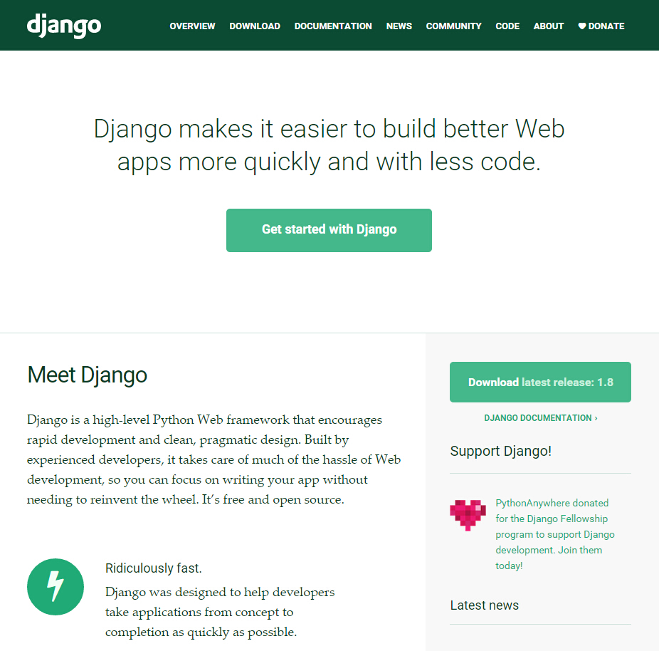

# Django学习笔记

## 1. 安装
* 目前支持从2.5（貌似）到最新的3.4的所有版本Python，所以建议走最高版本就好了，貌似最新版Python还自带了pip（一个python包管理工具，很好用，必备）。
* 安装在pip下超级简单，就是`pip install django==1.7.5`，1.7.5是当前最新版本
* 安装好以后，新建项目用：`django-admin.py startproject <项目名称>`，后，自动生成目录

## 2. 简单的用法
* 打开自带的WEB服务器是：`python manage.py runserver`
* Tour360目录下（暂时设定项目目录是Tour360）urls.py 是路由功能
* 视图模块需要自己创建 我设定是views.py
* 路由的写法：其实里面的Examples可以参考

	> \#url(r'^$','tour360.views.home',name='home'),   
	> \#url(r'^blog/',include('blog.urls')),  
	> url(r'^admin/',include(admin.site.urls)),  
	> url(r'^hello/',hello),  
	> url(r'^$',blank),  
* 记得路由urls.py里面要import视图的库，例如我的视图是: `from tour360.views import *`
 * 一个视图功能必须返回一个HttpResponse
* 参数在urls中的写法: `url(r'^hello/(\w+)/$',hello)`,用括号+正则的写法
* 在处理的views里面，添加offset参数,例如：`Def hello(request,offset):`，其实offset可以随便变成别的变量名。如果有多个参数，你就继续加就好了，变量名自己定就行
* **PS：参数始终是String型，就算是纯数字也是String型**

## 3. 有用的组件
* 目前主流的RESTFul框架：<http://www.django-rest-framework.org/>

## 4. 管理后台
* 通过: http://<website>/admin 进入，需要在serttings.py打开相关中间件和部件，不过默认是打开的。然后会要求用户账号，这个时候可以直接用:·python manager.py createsuperuser·，进入交互式的添加账号对话增加新的管理用户
* 默认是系统自己的数据的管理（有两个库的管理，一个是用户账号什么的）
* 如果要增加你自己的数据模型进去，则需要在app目录下的admin.py中：
	>from mysite.books.models import Publisher, Author, Book//这个是import你自己的模型  
	>from django.contrib import admin//这个是系统自动生成  
	>admin.site.register(Publisher)//括号中是你自己的模型对象  
	>admin.site.register(Author)//括号中是你自己的模型对象  
	>admin.site.register(Book)//括号中是你自己的模型对象  

* 非必填字段请在models中设定好，例如：
	> Class User(models.Model):  
	>>  Name = models.CharField(max_length=20,blank=True)  

* 可以自定义在管理界面下的数据编辑、列表页面，方法是在admin.py中自己写一个管理的类，例如:  
	>classMemberAdmin(admin.ModelAdmin):  
	>>  list_display=('name','phone','email','QQ')  

	>classActorAgentInfo(models.Model):
	>>  id=models.IntegerField(blank=True,null=False,primary_key=True,verbose_name='编号')  
	>>  status=models.IntegerField(blank=True,null=True,verbose_name='状态')  
	>>  agent_type=models.IntegerField(blank=True,null=True,verbose_name='客户类型')  

* 在数据库描述字段中加入verbose_name可以让字段在后台admin管理端口中显示指定的名字

* 然后，在注册到管理端口中的时候要多加入一个参数：·admin.site.register(Member,MemberAdmin)·，这样，在列表中就会显示name、phone、email、QQ这几个属性，很棒！
* 如果要加入搜索条，可以：·search_fields = ('first_name', 'last_name')·，参数是能搜索的字段
* 如果要加入过滤器，可以：·list_filter = ('publication_date')·
* 本地化可以在Setting.py中的MIDDLEWARE_CLASSES中加入中间件：·'django.middleware.locale.LocaleMiddleware'·
* model admin里建一个field，根据现在表的连接链接到另一张表的编辑页面或filter页面（听别的人说暂时没有实验）
* 如果新闻的 model 包含了 新闻分类 还有新闻内容 新闻内容 里头设置好了 外键 那么 admin 里头 list_display 可以直接指定新闻分类的哇 然后后台的界面中下拉菜单啥的直接帮你生成好了 ~~

## 5. 当前项目采用的环境
* Python 2.7.x（pyodbc对python版本有要求）
* Django 1.7.6
* virtualenv（虚拟开发环境）
* Pyodbc（通过odbc调用sqlserver）
* Django-pyodbc（数据库后端，需要某个exe的支持库，需要easy_install+本地文件名在virtualenv下安装到虚拟环境）
* SqlServer2008

## 6. 使用多数据库 multiple databases
